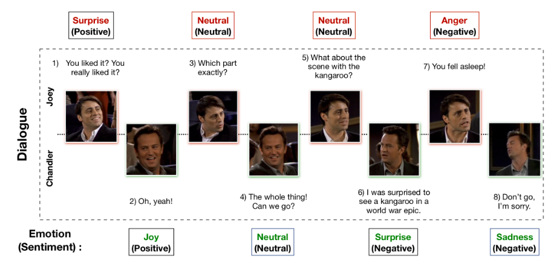
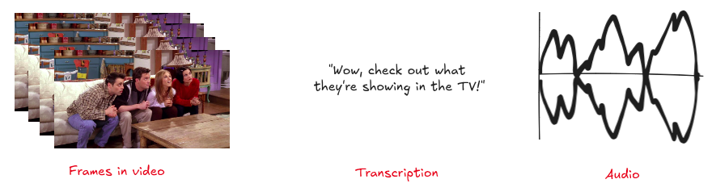
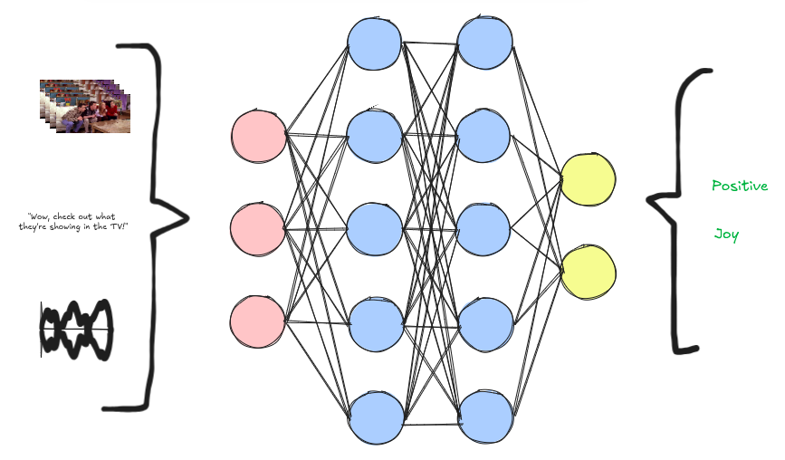

# ReelReveal Platform Design Document

## Multimodal EmotionLines Dataset (MELD)

MELD has more than 1400 dialogues and 13000 utterances from Friends TV series. Each utterance in a dialogue has been labeled by any of these seven emotions - Anger, Disgust, Sadness, Joy, Neutral, Surprise and Fear. MELD also has sentiment (positive, negative and neutral) annotation for each utterance.

An example dialogue from the MELD dataset is shown below:

## Video Sentiment Model

The high level diagram of the Video Sentiment Model is shown below:

## Modalities in the MELD Dataset

Modalities are the types of inputs or outputs that the model can work with. MELD dataset has utterances in 3 modalities - video, text, audio. These three modalities are shown below:

## Modalities in the Video Sentiment Model

Using a Video Sentiment Model that can work with all three modalities gives it a better chance of understanding the context and arrive at accurate emotion & sentiment predictions. Hence, we are building a Multimodal Video Sentiment Model.

